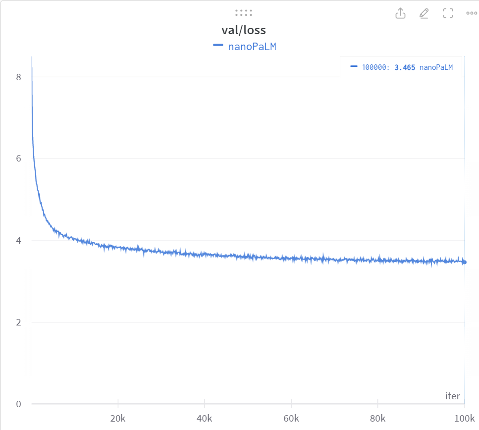

# nanoPALM


Inspired by nanoGPT, the simplest, fastest repository for training/finetuning small to medium-sized PALM models. 

This code tries to faithfully reproduce and create a functioning PaLM (Paper: https://arxiv.org/pdf/2204.02311.pdf) as efficiently as possible. 

Trained on OpenWebText, using ~213M params and running on a single Nvidia 3090 GPU for 100,000 iterations (~26 hours) yeilds a val loss of 3.465. I was able to achieve roughly 1.15s/iter on my single machine, running a batch size of 16 with 4 grad accumulations per optimizer step. I've also included the nsys report for those interested in looking at the profile of a couple iterations of the model!

# Getting started

## Requirements

The code in this repo should work with any version of Python >=3.9. The purpose of this repo is to be lightweight, we only have a few dependencies, you can install them by running:

```
pip install -r requirements.txt
```

## Prepare your training and validation data 

Simply run the following command. Warning this takes 54GB in huggingface .cache dir, and generates train.bin and val.bin which take up ~18GB

```
python data/openwebtext/prepare.py
```

## Training

Ideally you want to have some sort of consumer GPU, the code is actively being developed, but the data loader will raise a NotImplemented error for non-cuda devices.

Training should just work, hyper-parameters are defined globally in `train.py` for now, and all experimentation is documented as comments explaining why some original methods from the paper were excluded (specifically when they made training unstable).

For reference, training for 100k iterations on a 3090 takes about 1 day.

```
python train.py
```

# Results

## Sample 1

Prompt: `The meaning of life is`

Response: `The meaning of life is not lost in the development process or by establishing and maintaining an ideal of shared purpose, where work and practices may not be done in accordance with the principles of imbalances.`

## Sample 2

Prompt: `Once upon a time there was`

Response: `Once upon a time there was no form of protest. For the last few years there were almost a thousand people who were confronted by police. Earlier this year we had seen an increase in people arrested in the U.S. One in every 20 arrests were made in the U.S.`

## Training performance for ~1 day on a single consumer GPU


