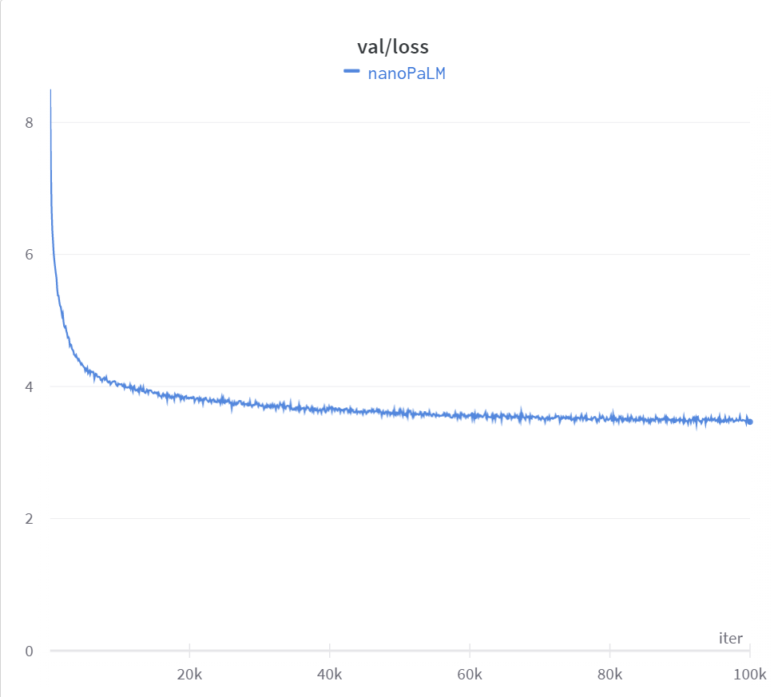

# nanoPALM

Inspired by nanoGPT, the simplest, fastest repository for training/finetuning small to medium-sized PALM models. 

This code tries to faithfully reproduce and create a functioning PaLM. Paper: https://arxiv.org/pdf/2204.02311.pdf

Trained on OpenWebText, running on a single consumer GPU for about 27 hours, stopping after 100k iterations.

# Getting started

## Requirements

The code in this repo should work with any version of Python >=3.9. The purpose of this repo is to be lightweight, we only have a few dependencies, you can install them by running:

```
pip install -r requirements.txt
```

## Prepare your training and validation data 

Simply run the following command. Warning this takes 54GB in huggingface .cache dir, and generates train.bin and val.bin which take up ~18GB

```
python data/openwebtext/prepare.py
```

## Training

Ideally you want to have some sort of consumer GPU, the code is actively being developed, but the data loader will raise a NotImplemented error for non-cuda devices.

Training should just work, hyper-parameters are defined globally in `train.py` for now, and all experimentation is documented as comments explaining why some original methods from the paper were excluded (specifically when they made training unstable).

For reference, training for 100k iterations on a 3090 takes about 1 day.

```
python train.py
```

# Results

Sample of training for ~1 day on a single consumer GPU


